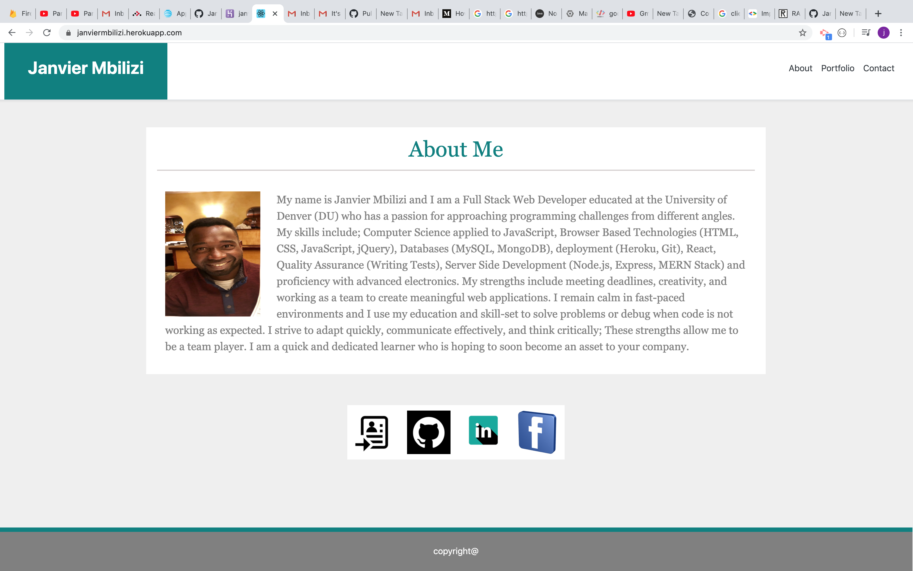

# Janvier Mbilizi

<strong>Name</strong>

This project takes my name (Janvier Mbilizi) as it is designed to show case my work.

<strong>Description </strong>

As a web developer, I want a deployed portfolio so that I can showcase my applications to potential employers and clients. It is in that spirit that my instructor gave me and other students a homework to design our personal website that will showcase our work.

<strong>Programs used</strong>

I used HTML, CSS (in Video Studio Code) and Bootstrap, React, node, express and nodemailer . And of cause Git/Github was used as version control and heroku for deployment.

<strong>Installation </strong>

This is only a website and does not need installation. it is currently hosted in github and you can access it at https://janviermbilizi.herokuapp.com/

<strong>Usage</strong>

The page is simple, clean, easy to use and undertand. The welcome page tells you about me. on the left side of the navigation bar you have Portfolio that showcase my applications. And Contact that gives you my contact addresses and a form to fill out in case you want to contact me.

<strong>Support and Contribution</strong>

If you have any question or want to see my Repo, please email me at janviermbilizi@gmail.com.

<strong>Authors and acknowledgement</strong>

As a unique Author of this project, I want to give a big thanks to my instructor and TAs who never get tired supporting or guiding me. Also thanks to my classmates who supported me directly or indirectly during this project.

<strong>Licence</strong>

Permissions of this strong copyleft license are conditioned on making available complete source code of licensed works and modifications, which include larger works using a licensed work, under the same license. Copyright and license notices must be preserved. Contributors provide an express grant of patent rights.

- Permissions Commercial use Distribution Modification Patent use Private use
- Conditions Disclose source License and copyright notice Same license State changes
- Limitations Liability Warranty
